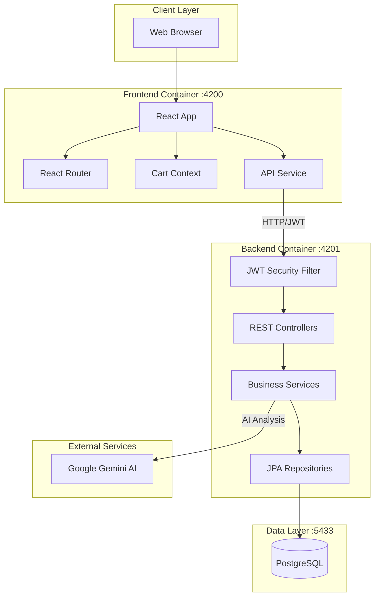
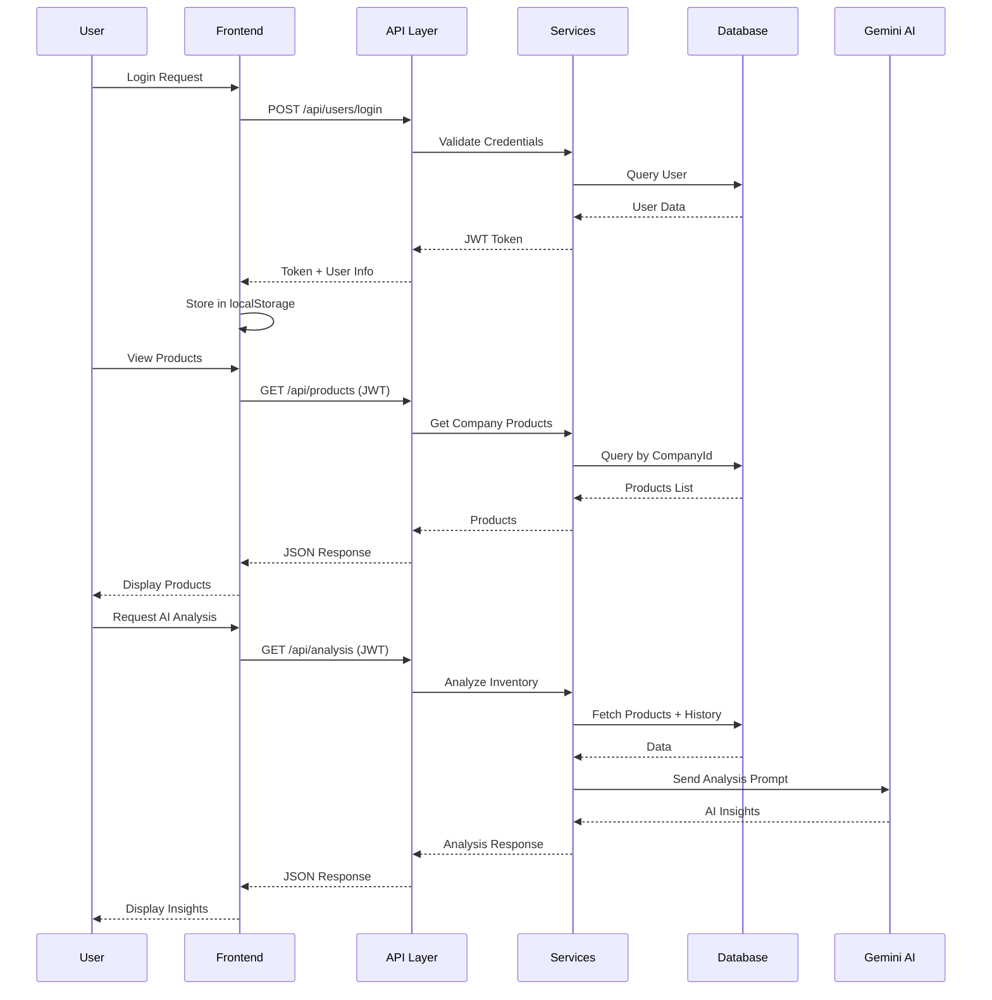
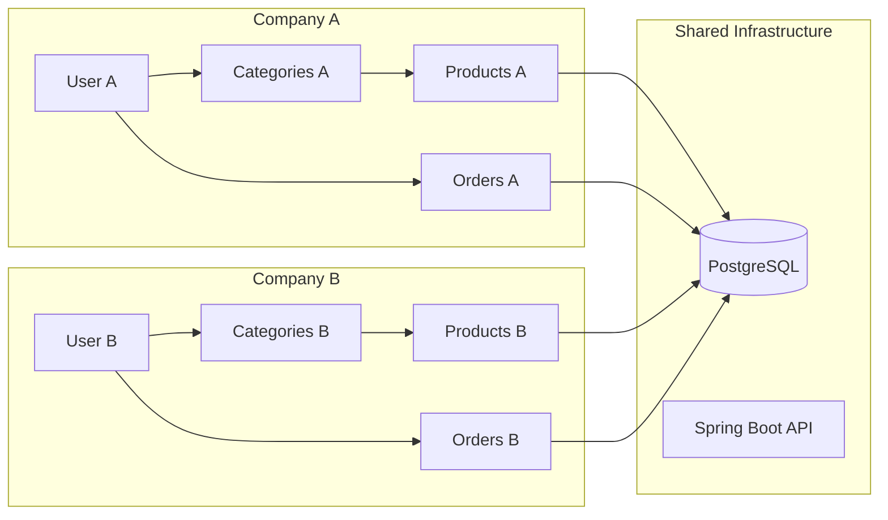
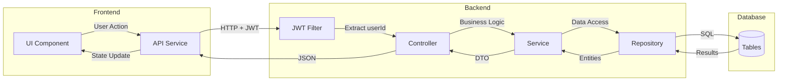

# System Architecture Overview

# Technology Stack

## Backend

### Core Framework
| Technology | Version | Purpose |
|------------|---------|---------|
| Java | 21 | Programming language |
| Spring Boot | 3.5.7 | Application framework |
| Spring Web | 3.5.7 | REST API development |
| Spring Data JPA | 3.5.7 | Database ORM |
| Spring Security | 3.5.7 | Authentication & authorization |

### Database
| Technology | Version | Purpose |
|------------|---------|---------|
| PostgreSQL | 16 | Relational database |
| Hibernate | 6.x | JPA implementation |

### Security & Authentication
| Technology | Version | Purpose |
|------------|---------|---------|
| JJWT | 0.11.5 | JWT token generation & validation |
| Spring Security Crypto | - | BCrypt password hashing |

### AI Integration
| Technology | Version | Purpose |
|------------|---------|---------|
| Google GenAI SDK | 1.32.0 | Gemini 3 Flash AI integration |
| Guava | 33.2.1 | Google utilities (GenAI dependency) |

### Document Generation
| Technology | Version | Purpose |
|------------|---------|---------|
| iText7 | 7.2.5 | PDF invoice generation |

### Utilities
| Technology | Version | Purpose |
|------------|---------|---------|
| Spring Dotenv | 4.0.0 | Environment variable management |
| Spring WebFlux | 3.5.7 | Reactive web support |

---

## Frontend

### Core Framework
| Technology | Version | Purpose |
|------------|---------|---------|
| React | 19.2.0 | UI library |
| TypeScript | 5.9.3 | Type-safe JavaScript |
| Vite | 7.2.2 | Build tool & dev server |

### Routing & HTTP
| Technology | Version | Purpose |
|------------|---------|---------|
| React Router | 7.9.6 | Client-side routing |
| Axios | 1.13.2 | HTTP client for API calls |

### UI Components
| Technology | Version | Purpose |
|------------|---------|---------|
| Radix UI | Various | Headless UI primitives |
| Lucide React | 0.553.0 | Icon library |
| TanStack React Table | 8.21.3 | Advanced data tables |

### Styling
| Technology | Version | Purpose |
|------------|---------|---------|
| Tailwind CSS | 4.1.17 | Utility-first CSS framework |
| tailwindcss-animate | 1.0.7 | Animation utilities |
| @tailwindcss/forms | 0.5.10 | Form styling plugin |
| Class Variance Authority | 0.7.1 | Component variant system |
| clsx | - | Conditional class names |
| tailwind-merge | - | Merge Tailwind classes |

### Radix UI Components Used
- `@radix-ui/react-checkbox`
- `@radix-ui/react-dialog`
- `@radix-ui/react-dropdown-menu`
- `@radix-ui/react-label`
- `@radix-ui/react-select`
- `@radix-ui/react-separator`
- `@radix-ui/react-slot`

---

## Infrastructure

### Containerization
| Technology | Version | Purpose |
|------------|---------|---------|
| Docker | - | Container runtime |
| Docker Compose | - | Multi-container orchestration |

### Container Images
| Service | Base Image |
|---------|------------|
| Backend | eclipse-temurin:21-jdk |
| Frontend | node:20-alpine + nginx |
| Database | postgres:16 |

---

## Development Tools

### Build Tools
| Tool | Purpose |
|------|---------|
| Maven | Backend dependency management & build |
| npm/pnpm | Frontend package management |
| Vite | Frontend dev server & bundler |

### Code Quality
| Tool | Purpose |
|------|---------|
| TypeScript | Static type checking |
| ESLint | JavaScript/TypeScript linting |

---

## External Services

| Service | Purpose |
|---------|---------|
| Google Gemini 3 Flash | AI-powered inventory analysis |


## High-Level Architecture



## Component Interaction Flow



## Multi-Tenant Architecture

The application implements multi-tenancy at the data level:



**Key Points:**
- Each user represents a company
- JWT token contains `userId` (companyId)
- All queries filter by `companyId`
- Complete data isolation between companies

## Request Flow Through Layers



## Technology Stack Layers

```
┌─────────────────────────────────────────────────────────────┐
│                      PRESENTATION LAYER                      │
│  React 19 │ TypeScript │ Tailwind CSS │ Radix UI │ Vite    │
├─────────────────────────────────────────────────────────────┤
│                      APPLICATION LAYER                       │
│  React Router │ Context API │ Axios │ TanStack Table        │
├─────────────────────────────────────────────────────────────┤
│                         API LAYER                            │
│  REST Controllers │ JWT Authentication │ CORS Config        │
├─────────────────────────────────────────────────────────────┤
│                       SERVICE LAYER                          │
│  OrderService │ InvoiceService │ GeminiAnalysisService      │
│  ProductCountHistoryService                                  │
├─────────────────────────────────────────────────────────────┤
│                     PERSISTENCE LAYER                        │
│  Spring Data JPA │ Hibernate │ PostgreSQL Driver            │
├─────────────────────────────────────────────────────────────┤
│                       DATA LAYER                             │
│  PostgreSQL 16 │ 6 Tables │ Indexes │ Foreign Keys          │
├─────────────────────────────────────────────────────────────┤
│                    EXTERNAL SERVICES                         │
│  Google Gemini 3 Flash API                                  │
└─────────────────────────────────────────────────────────────┘
```

## Key Architectural Decisions

### 1. Stateless Authentication
- JWT tokens for authentication
- No server-side sessions
- Token stored in browser localStorage
- Token passed in Authorization header

### 2. Multi-Tenant Data Isolation
- Single database, shared schema
- Company ID derived from JWT
- All queries scoped to company
- No cross-tenant data access possible

### 3. Audit Trail
- ProductCountHistory tracks all inventory changes
- Change types: INITIAL, SALE, RESTOCK, ADJUSTMENT
- Timestamps on all modifications

### 4. Order Workflow
- Two-state workflow: PENDING → FINALIZED
- Stock validation before finalization
- Automatic inventory deduction
- Invoice number generation on finalize

### 5. Data Snapshots
- OrderItems store product snapshots
- Price/title/image captured at order time
- Protects against product updates affecting history

# Codebase Folder Structure

## Project Root

```
Inventory-app/
├── frontend/                 # React frontend application
├── spring-app/               # Spring Boot backend application
├── docker-compose.yml        # Container orchestration
├── README.md                 # Project launch instructions
└── documentatie/             # Technical documentation
```

---

## Backend Structure

```
spring-app/
├── pom.xml                                    # Maven dependencies & build config
├── Dockerfile                                 # Container build instructions
├── .env                                       # Environment variables (local)
├── .env.template                              # Environment template
│
└── src/main/
    ├── java/net/javaguides/spring_app/
    │   │
    │   ├── SpringAppApplication.java          # Main entry point
    │   │
    │   ├── config/                            # Configuration classes
    │   │   ├── SecurityConfig.java            # Spring Security + JWT config
    │   │   └── CorsConfig.java                # CORS configuration
    │   │
    │   ├── security/                          # JWT implementation
    │   │   ├── JwtUtil.java                   # Token generation/validation
    │   │   └── JwtAuthenticationFilter.java   # Request filter
    │   │
    │   ├── controller/                        # REST API endpoints
    │   │   ├── UserController.java            # /api/users endpoints
    │   │   ├── CategoryController.java        # /api/categories endpoints
    │   │   ├── ProductController.java         # /api/products endpoints
    │   │   ├── OrderController.java           # /api/orders endpoints
    │   │   ├── AnalysisController.java        # /api/analysis endpoints
    │   │   ├── ProductCountHistoryController.java
    │   │   └── HelloController.java           # Test endpoints
    │   │
    │   ├── service/                           # Business logic
    │   │   ├── OrderService.java              # Order processing
    │   │   ├── InvoiceService.java            # PDF generation
    │   │   ├── GeminiAnalysisService.java     # AI integration
    │   │   └── ProductCountHistoryService.java # Stock tracking
    │   │
    │   ├── entity/                            # JPA entities
    │   │   ├── User.java                      # Company/user entity
    │   │   ├── Category.java                  # Product category
    │   │   ├── Product.java                   # Inventory product
    │   │   ├── Order.java                     # Customer order
    │   │   ├── OrderItem.java                 # Order line item
    │   │   └── ProductCountHistory.java       # Stock audit log
    │   │
    │   ├── repository/                        # Data access layer
    │   │   ├── UserRepository.java
    │   │   ├── CategoryRepository.java
    │   │   ├── ProductRepository.java
    │   │   ├── OrderRepository.java
    │   │   ├── OrderItemRepository.java
    │   │   └── ProductCountHistoryRepository.java
    │   │
    │   └── dto/                               # Data transfer objects
    │       ├── CreateOrderDTO.java            # Order creation request
    │       ├── OrderItemDTO.java              # Order item request
    │       └── InventoryAnalysisResponse.java # AI response structure
    │
    └── resources/
        └── application.properties             # Application configuration
```

### Backend File Descriptions

| Directory | Purpose |
|-----------|---------|
| `config/` | Spring configuration beans (Security, CORS) |
| `security/` | JWT token utilities and request filters |
| `controller/` | REST API endpoint handlers |
| `service/` | Business logic implementation |
| `entity/` | JPA entity classes (database tables) |
| `repository/` | Spring Data JPA interfaces |
| `dto/` | Request/response data structures |

---

## Frontend Structure

```
frontend/
├── package.json                    # Dependencies & scripts
├── tsconfig.json                   # TypeScript config (project refs)
├── tsconfig.app.json               # App TypeScript config
├── tsconfig.node.json              # Node TypeScript config
├── vite.config.ts                  # Vite build configuration
├── tailwind.config.js              # Tailwind theme & plugins
├── index.html                      # HTML entry point
│
├── public/
│   └── images/                     # Static images
│       ├── left-side-login-register-page.jpeg
│       └── right-side-login-register-page.jpeg
│
└── src/
    ├── main.tsx                    # React entry point
    ├── App.tsx                     # Root component & routes
    ├── App.css                     # Global app styles
    ├── index.css                   # Tailwind + CSS variables
    │
    ├── types/                      # TypeScript interfaces
    │   ├── product.ts              # Product type
    │   ├── category.ts             # Category type
    │   ├── order.ts                # Order types
    │   └── analysis.ts             # AI analysis types
    │
    ├── services/                   # API client
    │   └── api.ts                  # Axios instance & methods
    │
    ├── contexts/                   # React Context
    │   └── CartContext.tsx         # Shopping cart state
    │
    ├── lib/                        # Utilities
    │   └── utils.ts                # cn() class utility
    │
    ├── components/
    │   ├── Sidebar.tsx             # Navigation sidebar
    │   │
    │   ├── ui/                     # Reusable UI components
    │   │   ├── button.tsx          # Button with variants
    │   │   ├── card.tsx            # Card container
    │   │   ├── checkbox.tsx        # Checkbox input
    │   │   ├── dialog.tsx          # Modal dialog
    │   │   ├── dropdown-menu.tsx   # Dropdown menu
    │   │   ├── input.tsx           # Text input
    │   │   ├── label.tsx           # Form label
    │   │   ├── alert.tsx           # Alert messages
    │   │   ├── select.tsx          # Select dropdown
    │   │   ├── separator.tsx       # Divider
    │   │   └── table.tsx           # Data table
    │   │
    │   ├── inventory/              # Inventory components
    │   │   ├── CategoryCard.tsx    # Category display
    │   │   ├── ProductCard.tsx     # Product display
    │   │   ├── CategoryForm.tsx    # Category CRUD form
    │   │   ├── ProductForm.tsx     # Product CRUD form
    │   │   └── EmptyState.tsx      # Empty list placeholder
    │   │
    │   └── cart/                   # Cart components
    │       └── CartDrawer.tsx      # Shopping cart drawer
    │
    └── pages/                      # Page components
        ├── Login.tsx               # Login page
        ├── SignUp.tsx              # Registration page
        ├── Inventory.tsx           # Main inventory page
        ├── TableView.tsx           # Advanced table view
        ├── Analysis.tsx            # AI analysis page
        ├── Checkout.tsx            # Order checkout
        ├── Orders.tsx              # Order list
        ├── OrderDetail.tsx         # Single order view
        └── ComponentTest.tsx       # UI component testing
```

### Frontend File Descriptions

| Directory | Purpose |
|-----------|---------|
| `types/` | TypeScript interface definitions |
| `services/` | API client with Axios |
| `contexts/` | React Context providers |
| `components/ui/` | Reusable Radix UI components |
| `components/inventory/` | Inventory-specific components |
| `components/cart/` | Shopping cart components |
| `pages/` | Route page components |
| `lib/` | Utility functions |

---

## Configuration Files

| File | Purpose |
|------|---------|
| `docker-compose.yml` | Defines all containers and networks |
| `spring-app/pom.xml` | Maven dependencies for backend |
| `spring-app/application.properties` | Backend configuration |
| `frontend/package.json` | NPM dependencies for frontend |
| `frontend/vite.config.ts` | Vite dev server & build |
| `frontend/tailwind.config.js` | Tailwind theme customization |
| `frontend/tsconfig.json` | TypeScript compiler options |
