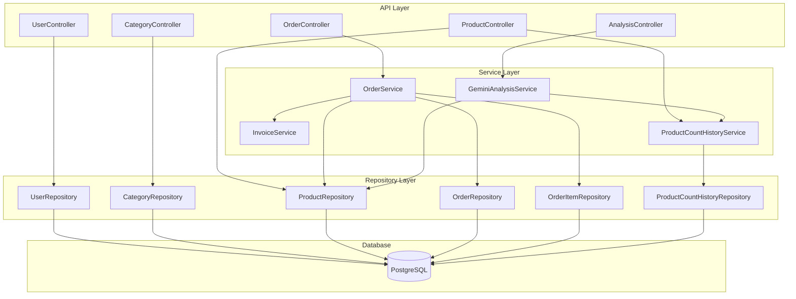

# Backend Architecture

## Overview

The backend is a Spring Boot 3.5.7 application using Java 21, implementing a RESTful API with JWT authentication, PostgreSQL database, and Google Gemini AI integration.

## Architecture Pattern

The application follows the **Controller-Service-Repository** pattern:



---

## Controllers

### UserController
**Path:** `/api/users`

| Method | Endpoint | Auth | Description |
|--------|----------|------|-------------|
| POST | `/login` | No | Authenticate user, return JWT |
| GET | `/` | Yes | List all users |
| GET | `/{id}` | Yes | Get user by ID |
| POST | `/` | No | Register new user |
| PUT | `/{id}` | Yes | Update user |
| DELETE | `/{id}` | Yes | Delete user |

### CategoryController
**Path:** `/api/categories`

| Method | Endpoint | Auth | Description |
|--------|----------|------|-------------|
| GET | `/` | Yes | List company categories |
| GET | `/{id}` | Yes | Get category by ID |
| POST | `/` | Yes | Create category |
| PUT | `/{id}` | Yes | Update category |
| DELETE | `/{id}` | Yes | Delete category (cascade) |

### ProductController
**Path:** `/api/products`

| Method | Endpoint | Auth | Description |
|--------|----------|------|-------------|
| GET | `/` | Yes | List company products |
| GET | `/category/{id}` | Yes | Products by category |
| GET | `/{id}` | Yes | Get product by ID |
| POST | `/` | Yes | Create product |
| PUT | `/{id}` | Yes | Update product |
| DELETE | `/{id}` | Yes | Delete product |
| GET | `/{id}/history` | Yes | Product stock history |
| GET | `/history` | Yes | Company stock history |

### OrderController
**Path:** `/api/orders`

| Method | Endpoint | Auth | Description |
|--------|----------|------|-------------|
| GET | `/` | Yes | List orders (optional status filter) |
| GET | `/{id}` | Yes | Get order by ID |
| POST | `/` | Yes | Create order |
| PUT | `/{id}` | Yes | Update pending order |
| DELETE | `/{id}` | Yes | Delete pending order |
| POST | `/{id}/finalize` | Yes | Finalize order |
| GET | `/{id}/invoice` | Yes | Download PDF invoice |
| GET | `/stats` | Yes | Order statistics |

### AnalysisController
**Path:** `/api/analysis`

| Method | Endpoint | Auth | Description |
|--------|----------|------|-------------|
| GET | `/` | Yes | Full AI analysis |
| GET | `/quick-stats` | Yes | Basic stats (no AI) |

---

## Services

### OrderService
**File:** `service/OrderService.java`

Handles complete order lifecycle:
- **Create Order**: Validates products, calculates totals
- **Update Order**: Only PENDING orders can be modified
- **Delete Order**: Only PENDING orders can be deleted
- **Finalize Order**:
  - Validates stock availability
  - Deducts inventory
  - Records stock history (SALE type)
  - Generates invoice number (INV-XXXXX)
  - Sets finalized timestamp

```java
@Transactional
public Order finalizeOrder(Long orderId, Long companyId) {
    // 1. Validate order exists and is PENDING
    // 2. Check stock for all items
    // 3. Deduct stock from products
    // 4. Record history for each item
    // 5. Generate invoice number
    // 6. Set status to FINALIZED
    // 7. Save and return order
}
```

### InvoiceService
**File:** `service/InvoiceService.java`

Generates PDF invoices using iText7:
- Company header with seller info
- Client information section
- Itemized product table
- Subtotal, tax, and total calculations
- Invoice number and date

### GeminiAnalysisService
**File:** `service/GeminiAnalysisService.java`

Integrates with Google Gemini 3 Flash:
- Builds analysis prompt with inventory data
- Includes 6-month stock history
- Parses JSON response from AI
- Returns structured analysis with:
  - Health status assessment
  - Top selling products
  - Restock recommendations
  - Business insights

### ProductCountHistoryService
**File:** `service/ProductCountHistoryService.java`

Tracks all inventory changes:
- **recordCountChange()**: Logs changes with type
- **recordInitialCount()**: Tracks new products
- **getProductHistory()**: Per-product audit trail
- **getCompanyHistoryLastMonths()**: Time-range queries
- **getTotalSoldByProducts()**: Aggregated sales data

---

## Entities

### User Entity
```java
@Entity
@Table(name = "users")
public class User {
    @Id @GeneratedValue
    private Long id;

    @Column(nullable = false)
    private String companyName;

    @Column(unique = true, nullable = false)
    private String companyEmail;

    @Column(nullable = false)
    private String password;  // BCrypt hashed

    @OneToMany(mappedBy = "user", cascade = CascadeType.ALL)
    private List<Category> categories;
}
```

### Category Entity
```java
@Entity
@Table(name = "categories")
public class Category {
    @Id @GeneratedValue
    private Long id;

    @ManyToOne
    @JoinColumn(name = "company_id")
    private User user;

    private String title;
    private String image;  // Base64

    @OneToMany(mappedBy = "category", cascade = CascadeType.ALL)
    private List<Product> products;
}
```

### Product Entity
```java
@Entity
@Table(name = "products")
public class Product {
    @Id @GeneratedValue
    private Long id;

    @ManyToOne
    @JoinColumn(name = "category_id")
    private Category category;

    private String title;
    private String image;   // Base64
    private Double price;
    private Integer count;  // Stock level
}
```

### Order Entity
```java
@Entity
@Table(name = "orders")
public class Order {
    @Id @GeneratedValue
    private Long id;

    @ManyToOne
    @JoinColumn(name = "company_id")
    private User company;

    // Client info
    private String clientName;
    private String clientCompany;
    private String clientAddress;
    private String clientCity;
    private String clientPostalCode;
    private String clientPhone;
    private String clientEmail;
    private String notes;

    // Order state
    @Enumerated(EnumType.STRING)
    private OrderStatus status;  // PENDING, FINALIZED

    private LocalDateTime createdAt;
    private LocalDateTime finalizedAt;
    private String invoiceNumber;

    // Totals
    private Integer totalItems;
    private Double totalAmount;

    @OneToMany(mappedBy = "order", cascade = CascadeType.ALL)
    private List<OrderItem> items;
}
```

### OrderItem Entity
```java
@Entity
@Table(name = "order_items")
public class OrderItem {
    @Id @GeneratedValue
    private Long id;

    @ManyToOne
    @JoinColumn(name = "order_id")
    private Order order;

    @ManyToOne
    @JoinColumn(name = "product_id")
    private Product product;

    // Snapshot data (preserves history)
    private String productTitle;
    private String productImage;
    private Double unitPrice;

    private Integer quantity;
    private Double subtotal;
}
```

### ProductCountHistory Entity
```java
@Entity
@Table(name = "product_count_history")
public class ProductCountHistory {
    @Id @GeneratedValue
    private Long id;

    @ManyToOne
    @JoinColumn(name = "product_id")
    private Product product;

    private Integer oldCount;
    private Integer newCount;
    private Integer changeAmount;

    @Enumerated(EnumType.STRING)
    private ChangeType changeType;  // INITIAL, SALE, RESTOCK, ADJUSTMENT

    private LocalDateTime changedAt;
    private String notes;
}
```

---

## Repository Layer

All repositories extend `JpaRepository` with custom queries:

```java
public interface ProductRepository extends JpaRepository<Product, Long> {
    List<Product> findByCategoryId(Long categoryId);
    List<Product> findByCategoryUserId(Long userId);
}

public interface OrderRepository extends JpaRepository<Order, Long> {
    List<Order> findByCompanyIdOrderByCreatedAtDesc(Long companyId);
    List<Order> findByCompanyIdAndStatusOrderByCreatedAtDesc(Long companyId, OrderStatus status);
}

public interface ProductCountHistoryRepository extends JpaRepository<ProductCountHistory, Long> {
    List<ProductCountHistory> findByProductIdOrderByChangedAtDesc(Long productId);

    @Query("SELECT h FROM ProductCountHistory h WHERE h.product.category.user.id = :companyId AND h.changedAt >= :since")
    List<ProductCountHistory> findByCompanyIdAndChangedAtAfter(Long companyId, LocalDateTime since);
}
```

---

## Configuration

### Application Properties
```properties
# Database
spring.datasource.url=${DB_URL}
spring.datasource.username=${DB_USERNAME}
spring.datasource.password=${DB_PASSWORD}

# JPA
spring.jpa.hibernate.ddl-auto=update
spring.jpa.show-sql=true

# Server
server.port=${SERVER_PORT:8080}

# JWT
jwt.secret=${JWT_SECRET}
jwt.expiration=${JWT_EXPIRATION}

# Gemini AI
gemini.api.key=${GEMINI_API_KEY}
gemini.model=gemini-3-flash-preview
```

### Security Configuration
```java
@Configuration
@EnableWebSecurity
public class SecurityConfig {
    @Bean
    public SecurityFilterChain filterChain(HttpSecurity http) {
        http
            .cors(cors -> cors.configurationSource(corsConfig()))
            .csrf(csrf -> csrf.disable())
            .sessionManagement(session ->
                session.sessionCreationPolicy(SessionCreationPolicy.STATELESS))
            .authorizeHttpRequests(auth -> auth
                .requestMatchers("/api/users/login", "/api/users").permitAll()
                .anyRequest().authenticated())
            .addFilterBefore(jwtFilter, UsernamePasswordAuthenticationFilter.class);
        return http.build();
    }
}
```
