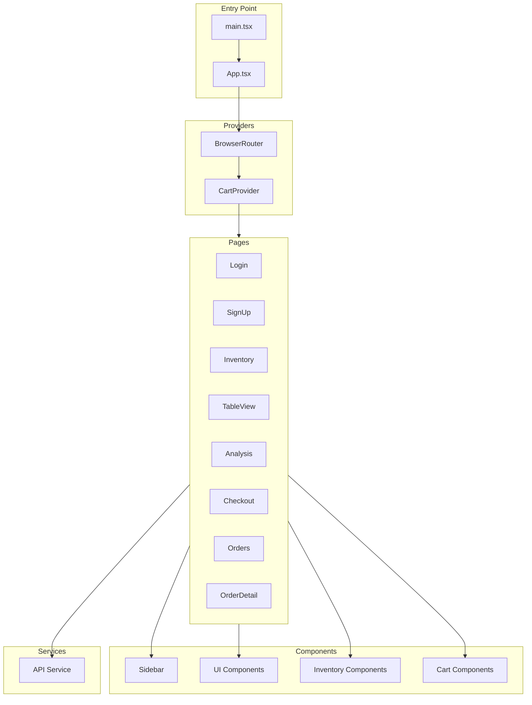
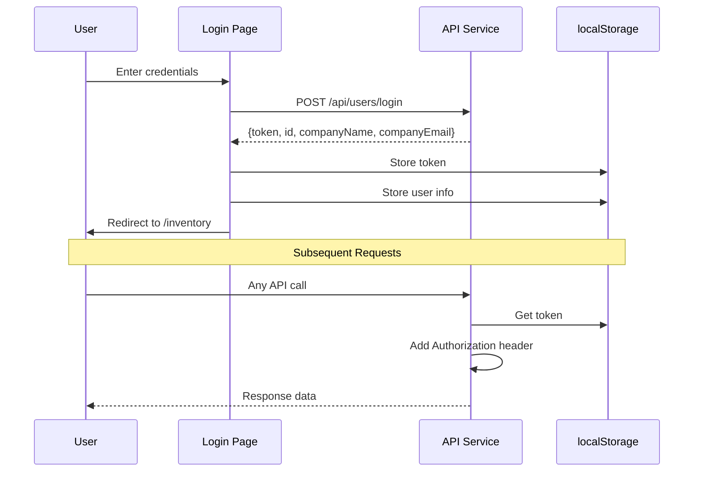

# Frontend Architecture

## Overview

The frontend is a React 19 application built with TypeScript, Vite, and Tailwind CSS. It implements a modern SPA architecture with React Router for navigation and Context API for state management.

## Application Structure



---

## Routing

**File:** `src/App.tsx`

| Route | Component | Auth | Description |
|-------|-----------|------|-------------|
| `/login` | Login | No | User authentication |
| `/signup` | SignUp | No | Account registration |
| `/inventory` | Inventory | Yes | Category/product management |
| `/table-view` | TableView | Yes | Advanced data table |
| `/analysis` | Analysis | Yes | AI-powered insights |
| `/checkout` | Checkout | Yes | Order creation form |
| `/orders` | Orders | Yes | Order list |
| `/orders/:id` | OrderDetail | Yes | Single order view |
| `/` | Redirect | - | Redirects to `/login` |

### Protected Route Pattern
```tsx
// Routes check for token before rendering
{token ? <Inventory /> : <Navigate to="/login" />}
```

---

## State Management

### 1. CartContext
**File:** `src/contexts/CartContext.tsx`

Manages shopping cart with localStorage persistence:

```tsx
interface CartItem {
  product: Product;
  quantity: number;
}

interface CartContextType {
  items: CartItem[];
  addItem: (product: Product, quantity: number) => void;
  updateQuantity: (productId: number, quantity: number) => void;
  removeItem: (productId: number) => void;
  clearCart: () => void;
  totalItems: number;
  totalAmount: number;
}
```

**Features:**
- Persists to `localStorage['warehouse_cart']`
- Prevents exceeding product stock
- Auto-removes items when quantity = 0
- Computes totals on the fly

### 2. localStorage State
```typescript
// Authentication
localStorage['token']  // JWT token
localStorage['user']   // User object {id, companyName, companyEmail}

// Cart
localStorage['warehouse_cart']  // Serialized cart items
```

### 3. Component Local State
Pages use `useState` for:
- Data fetching results
- Form inputs
- Modal visibility
- Loading states
- Error messages

---

## API Service

**File:** `src/services/api.ts`

### Axios Configuration
```typescript
const api = axios.create({
  baseURL: `${import.meta.env.VITE_API_URL}/api`,
  timeout: 10000,
});

// Add JWT token to all requests
api.interceptors.request.use((config) => {
  const token = localStorage.getItem('token');
  if (token) {
    config.headers.Authorization = `Bearer ${token}`;
  }
  return config;
});
```

### API Methods

```typescript
const apiService = {
  auth: {
    login: (email, password) => Promise<User>,
    signup: (user) => Promise<User>,
  },

  users: {
    getAll: () => Promise<User[]>,
    getById: (id) => Promise<User>,
    create: (user) => Promise<User>,
    update: (id, user) => Promise<User>,
    delete: (id) => Promise<void>,
  },

  categories: {
    getAll: () => Promise<Category[]>,
    getById: (id) => Promise<Category>,
    create: (category) => Promise<Category>,
    update: (id, category) => Promise<Category>,
    delete: (id) => Promise<void>,
  },

  products: {
    getAll: () => Promise<Product[]>,
    getByCategory: (categoryId) => Promise<Product[]>,
    getById: (id) => Promise<Product>,
    create: (product) => Promise<Product>,
    update: (id, product) => Promise<Product>,
    delete: (id) => Promise<void>,
  },

  orders: {
    getAll: (status?) => Promise<Order[]>,
    getById: (id) => Promise<Order>,
    create: (data) => Promise<Order>,
    update: (id, data) => Promise<Order>,
    delete: (id) => Promise<void>,
    finalize: (id) => Promise<Order>,
    downloadInvoice: (id) => Promise<Blob>,
    getStats: () => Promise<OrderStats>,
  },

  analysis: {
    getAnalysis: () => Promise<InventoryAnalysis>,
    getQuickStats: () => Promise<QuickStats>,
  },
};
```

---

## Component Library

### UI Components (Radix-based)
**Directory:** `src/components/ui/`

| Component | File | Description |
|-----------|------|-------------|
| Button | `button.tsx` | Variants: default, destructive, outline, secondary, ghost, link |
| Card | `card.tsx` | Container with header, content, footer slots |
| Dialog | `dialog.tsx` | Modal overlay with content |
| DropdownMenu | `dropdown-menu.tsx` | Dropdown with trigger and items |
| Input | `input.tsx` | Text input field |
| Label | `label.tsx` | Form label |
| Alert | `alert.tsx` | Status messages |
| Checkbox | `checkbox.tsx` | Checkbox input |
| Select | `select.tsx` | Dropdown select |
| Separator | `separator.tsx` | Divider line |
| Table | `table.tsx` | Composed table elements |

### Button Variants
```tsx
<Button variant="default">Primary</Button>
<Button variant="destructive">Delete</Button>
<Button variant="outline">Secondary</Button>
<Button variant="ghost">Subtle</Button>
```

### Inventory Components
**Directory:** `src/components/inventory/`

| Component | Description |
|-----------|-------------|
| CategoryCard | Displays category with image, title, actions |
| ProductCard | Displays product with price, stock, cart actions |
| CategoryForm | Create/edit category dialog |
| ProductForm | Create/edit product dialog |
| EmptyState | Placeholder when no items |

### Cart Components
**Directory:** `src/components/cart/`

| Component | Description |
|-----------|-------------|
| CartDrawer | Slide-out cart panel with items, quantities, total |

---

## Pages

### Login Page
**File:** `src/pages/Login.tsx`

- Split layout (hero + form)
- Email/password inputs
- Remember me checkbox
- Show/hide password
- Error handling
- Success message from signup

### SignUp Page
**File:** `src/pages/SignUp.tsx`

- Company name, email, password
- Password strength validation
- Confirm password match
- Terms acceptance
- Redirects to login on success

### Inventory Page
**File:** `src/pages/Inventory.tsx`

- Category grid view
- Product cards per category
- CRUD dialogs for categories/products
- Image upload (base64)
- Add to cart functionality

### TableView Page
**File:** `src/pages/TableView.tsx`

Uses TanStack React Table:
- Column sorting
- Column filtering
- Column visibility toggle
- Stock adjustment controls
- Search by name/category

### Analysis Page
**File:** `src/pages/Analysis.tsx`

- Quick stats cards (no AI)
- "Generate AI Analysis" button
- Loading state during AI call
- Displays:
  - Health status with color
  - Top selling products table
  - Restock recommendations
  - Business insights grid

### Checkout Page
**File:** `src/pages/Checkout.tsx`

- Client information form
- Cart summary
- Creates order in PENDING status

### Orders Page
**File:** `src/pages/Orders.tsx`

- Status filter (All/Pending/Finalized)
- Order cards with details
- Finalize button for pending
- PDF invoice download

### OrderDetail Page
**File:** `src/pages/OrderDetail.tsx`

- Full order information
- Client details
- Items table
- Actions (finalize, download invoice)

---

## Styling System

### Tailwind Configuration
**File:** `tailwind.config.js`

```javascript
module.exports = {
  darkMode: 'class',
  theme: {
    extend: {
      colors: {
        primary: { /* charcoal grays */ },
        secondary: { /* sky blues */ },
        accent: { /* amber/gold */ },
        success: { /* greens */ },
        error: { /* reds */ },
      },
      animation: {
        'gradient': 'gradient 8s linear infinite',
        'blob': 'blob 7s infinite',
        'fade-in': 'fade-in 0.5s ease-out',
        'slide-up': 'slide-up 0.5s ease-out',
      },
    },
  },
};
```

### CSS Variables
**File:** `src/index.css`

Uses OKLch color space for theme variables:
```css
:root {
  --background: oklch(1 0 0);
  --foreground: oklch(0.141 0.005 285.823);
  --primary: oklch(0.21 0.006 285.885);
  --secondary: oklch(0.967 0.001 286.375);
  /* ... more variables */
}
```

### Utility Function
**File:** `src/lib/utils.ts`

```typescript
import { clsx, type ClassValue } from "clsx";
import { twMerge } from "tailwind-merge";

export function cn(...inputs: ClassValue[]) {
  return twMerge(clsx(inputs));
}
```

---

## Type Definitions

### Product Type
```typescript
interface Product {
  id: number;
  categoryId: number;
  title: string;
  image: string;  // Base64
  price: number;
  count: number;
}
```

### Category Type
```typescript
interface Category {
  id: number;
  companyId: number;
  title: string;
  image: string;  // Base64
}
```

### Order Types
```typescript
interface Order {
  id: number;
  companyId: number;
  clientName: string;
  clientCompany?: string;
  clientAddress: string;
  clientCity: string;
  clientPostalCode: string;
  clientPhone: string;
  clientEmail?: string;
  notes?: string;
  status: 'PENDING' | 'FINALIZED';
  createdAt: string;
  finalizedAt?: string;
  invoiceNumber?: string;
  totalItems: number;
  totalAmount: number;
  items: OrderItem[];
}

interface OrderItem {
  id: number;
  productId: number;
  productTitle: string;
  productImage: string;
  quantity: number;
  unitPrice: number;
  subtotal: number;
}
```

### Analysis Types
```typescript
interface InventoryAnalysis {
  summary: {
    totalProducts: number;
    totalUnitsSold: number;
    healthStatus: 'Excellent' | 'Good' | 'Warning' | 'Critical';
    description: string;
  };
  topSellingProducts: TopProduct[];
  recommendations: Recommendation[];
  insights: Insight[];
}
```

---

## Authentication Flow



### Logout Flow
```typescript
const handleLogout = () => {
  localStorage.removeItem('token');
  localStorage.removeItem('user');
  navigate('/login');
};
```
