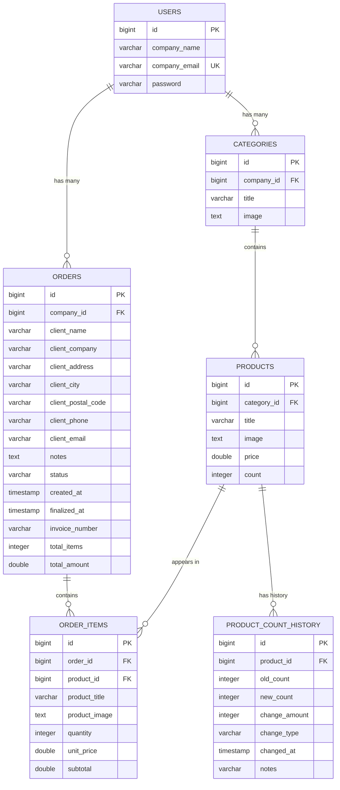

# Database Schema

## Overview

The application uses PostgreSQL 16 with Hibernate/JPA for ORM. The schema supports multi-tenant data isolation where each user represents a company.

## Entity Relationship Diagram



---

## Table Definitions

### users
Primary table for company/user accounts.

| Column | Type | Constraints | Description |
|--------|------|-------------|-------------|
| id | BIGSERIAL | PRIMARY KEY | Auto-increment ID |
| company_name | VARCHAR(255) | NOT NULL | Company display name |
| company_email | VARCHAR(255) | UNIQUE, NOT NULL | Login email |
| password | VARCHAR(255) | NOT NULL | BCrypt hashed password |

```sql
CREATE TABLE users (
    id BIGSERIAL PRIMARY KEY,
    company_name VARCHAR(255) NOT NULL,
    company_email VARCHAR(255) UNIQUE NOT NULL,
    password VARCHAR(255) NOT NULL
);
```

---

### categories
Product categories owned by a company.

| Column | Type | Constraints | Description |
|--------|------|-------------|-------------|
| id | BIGSERIAL | PRIMARY KEY | Auto-increment ID |
| company_id | BIGINT | FOREIGN KEY | Owner company |
| title | VARCHAR(255) | NOT NULL | Category name |
| image | TEXT | NOT NULL | Base64 encoded image |

```sql
CREATE TABLE categories (
    id BIGSERIAL PRIMARY KEY,
    company_id BIGINT REFERENCES users(id) ON DELETE CASCADE,
    title VARCHAR(255) NOT NULL,
    image TEXT NOT NULL
);

CREATE INDEX idx_category_company ON categories(company_id);
```

---

### products
Inventory products within categories.

| Column | Type | Constraints | Description |
|--------|------|-------------|-------------|
| id | BIGSERIAL | PRIMARY KEY | Auto-increment ID |
| category_id | BIGINT | FOREIGN KEY | Parent category |
| title | VARCHAR(255) | NOT NULL | Product name |
| image | TEXT | NOT NULL | Base64 encoded image |
| price | DOUBLE PRECISION | NOT NULL | Unit price |
| count | INTEGER | NOT NULL | Stock quantity |

```sql
CREATE TABLE products (
    id BIGSERIAL PRIMARY KEY,
    category_id BIGINT REFERENCES categories(id) ON DELETE CASCADE,
    title VARCHAR(255) NOT NULL,
    image TEXT NOT NULL,
    price DOUBLE PRECISION NOT NULL,
    count INTEGER NOT NULL DEFAULT 0
);

CREATE INDEX idx_product_category ON products(category_id);
```

---

### orders
Customer orders with status workflow.

| Column | Type | Constraints | Description |
|--------|------|-------------|-------------|
| id | BIGSERIAL | PRIMARY KEY | Auto-increment ID |
| company_id | BIGINT | FOREIGN KEY | Owner company |
| client_name | VARCHAR(255) | NOT NULL | Customer name |
| client_company | VARCHAR(255) | | Customer company |
| client_address | VARCHAR(255) | NOT NULL | Street address |
| client_city | VARCHAR(255) | NOT NULL | City |
| client_postal_code | VARCHAR(50) | NOT NULL | Postal/ZIP code |
| client_phone | VARCHAR(50) | NOT NULL | Phone number |
| client_email | VARCHAR(255) | | Email address |
| notes | TEXT | | Order notes |
| status | VARCHAR(20) | NOT NULL | PENDING or FINALIZED |
| created_at | TIMESTAMP | NOT NULL | Creation time |
| finalized_at | TIMESTAMP | | Finalization time |
| invoice_number | VARCHAR(50) | | Generated invoice # |
| total_items | INTEGER | | Sum of quantities |
| total_amount | DOUBLE PRECISION | | Total order value |

```sql
CREATE TABLE orders (
    id BIGSERIAL PRIMARY KEY,
    company_id BIGINT REFERENCES users(id),
    client_name VARCHAR(255) NOT NULL,
    client_company VARCHAR(255),
    client_address VARCHAR(255) NOT NULL,
    client_city VARCHAR(255) NOT NULL,
    client_postal_code VARCHAR(50) NOT NULL,
    client_phone VARCHAR(50) NOT NULL,
    client_email VARCHAR(255),
    notes TEXT,
    status VARCHAR(20) NOT NULL DEFAULT 'PENDING',
    created_at TIMESTAMP NOT NULL DEFAULT CURRENT_TIMESTAMP,
    finalized_at TIMESTAMP,
    invoice_number VARCHAR(50),
    total_items INTEGER,
    total_amount DOUBLE PRECISION
);

CREATE INDEX idx_order_company ON orders(company_id);
CREATE INDEX idx_order_status ON orders(status);
CREATE INDEX idx_order_created ON orders(created_at);
```

---

### order_items
Line items within orders (product snapshots).

| Column | Type | Constraints | Description |
|--------|------|-------------|-------------|
| id | BIGSERIAL | PRIMARY KEY | Auto-increment ID |
| order_id | BIGINT | FOREIGN KEY | Parent order |
| product_id | BIGINT | FOREIGN KEY | Original product |
| product_title | VARCHAR(255) | NOT NULL | Snapshot: product name |
| product_image | TEXT | | Snapshot: product image |
| quantity | INTEGER | NOT NULL | Ordered quantity |
| unit_price | DOUBLE PRECISION | NOT NULL | Price at order time |
| subtotal | DOUBLE PRECISION | | quantity * unit_price |

```sql
CREATE TABLE order_items (
    id BIGSERIAL PRIMARY KEY,
    order_id BIGINT REFERENCES orders(id) ON DELETE CASCADE,
    product_id BIGINT REFERENCES products(id),
    product_title VARCHAR(255) NOT NULL,
    product_image TEXT,
    quantity INTEGER NOT NULL,
    unit_price DOUBLE PRECISION NOT NULL,
    subtotal DOUBLE PRECISION
);

CREATE INDEX idx_order_item_order ON order_items(order_id);
CREATE INDEX idx_order_item_product ON order_items(product_id);
```

---

### product_count_history
Audit trail for inventory changes.

| Column | Type | Constraints | Description |
|--------|------|-------------|-------------|
| id | BIGSERIAL | PRIMARY KEY | Auto-increment ID |
| product_id | BIGINT | FOREIGN KEY | Related product |
| old_count | INTEGER | NOT NULL | Count before change |
| new_count | INTEGER | NOT NULL | Count after change |
| change_amount | INTEGER | | Difference |
| change_type | VARCHAR(20) | NOT NULL | INITIAL/SALE/RESTOCK/ADJUSTMENT |
| changed_at | TIMESTAMP | NOT NULL | When change occurred |
| notes | VARCHAR(255) | | Optional note |

```sql
CREATE TABLE product_count_history (
    id BIGSERIAL PRIMARY KEY,
    product_id BIGINT REFERENCES products(id) ON DELETE CASCADE,
    old_count INTEGER NOT NULL,
    new_count INTEGER NOT NULL,
    change_amount INTEGER,
    change_type VARCHAR(20) NOT NULL,
    changed_at TIMESTAMP NOT NULL DEFAULT CURRENT_TIMESTAMP,
    notes VARCHAR(255)
);

CREATE INDEX idx_history_product_id ON product_count_history(product_id);
CREATE INDEX idx_history_changed_at ON product_count_history(changed_at);
```

---

## Relationships Summary

| Parent | Child | Type | On Delete |
|--------|-------|------|-----------|
| users | categories | 1:N | CASCADE |
| users | orders | 1:N | - |
| categories | products | 1:N | CASCADE |
| orders | order_items | 1:N | CASCADE |
| products | order_items | 1:N | SET NULL |
| products | product_count_history | 1:N | CASCADE |

---

## Enums

### OrderStatus
```java
public enum OrderStatus {
    PENDING,    // Order created, can be modified
    FINALIZED   // Order completed, stock deducted
}
```

### ChangeType
```java
public enum ChangeType {
    INITIAL,    // Product created
    SALE,       // Stock decreased (order finalized)
    RESTOCK,    // Stock increased
    ADJUSTMENT  // Manual adjustment
}
```

---

## Data Isolation

All queries are scoped by `company_id`:

```java
// CategoryRepository
List<Category> findByUserId(Long userId);

// ProductRepository
List<Product> findByCategoryUserId(Long userId);

// OrderRepository
List<Order> findByCompanyIdOrderByCreatedAtDesc(Long companyId);
```

This ensures complete data isolation between companies.
