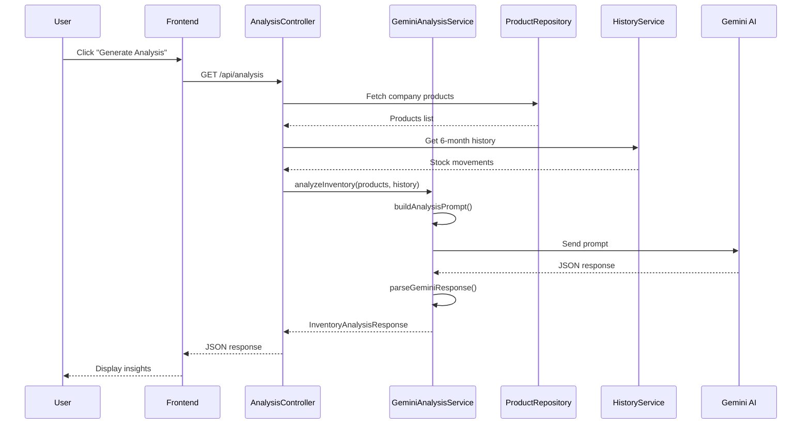

# AI Implementation - Google Gemini Integration

## Overview

The application integrates Google Gemini 3 Flash for AI-powered inventory analysis. The AI analyzes product data and 6-month stock history to provide insights, recommendations, and health assessments.

## Architecture



---

## Backend Implementation

### GeminiAnalysisService

**File:** `spring-app/src/main/java/net/javaguides/spring_app/service/GeminiAnalysisService.java`

```java
@Service
public class GeminiAnalysisService {

    @Value("${gemini.api.key}")
    private String geminiApiKey;

    @Value("${gemini.model:gemini-3-flash-preview}")
    private String modelName;

    public InventoryAnalysisResponse analyzeInventory(
            List<Product> products,
            Map<Long, Integer> salesData,
            Map<Long, Integer> restockData) {

        // 1. Build the analysis prompt
        String prompt = buildAnalysisPrompt(products, salesData, restockData);

        // 2. Call Gemini API
        String response = callGemini3Api(prompt);

        // 3. Parse JSON response
        return parseGeminiResponse(response, products);
    }
}
```

### Prompt Engineering

The service constructs a detailed prompt with:

1. **Role Definition**: Establishes AI as inventory management expert
2. **Current Inventory Data**: Products with prices and stock levels
3. **Historical Data**: 6-month sales and restock volumes
4. **Output Format**: Explicit JSON schema requirements

```java
private String buildAnalysisPrompt(List<Product> products,
                                   Map<Long, Integer> salesData,
                                   Map<Long, Integer> restockData) {
    StringBuilder prompt = new StringBuilder();

    prompt.append("""
        You are an inventory management AI assistant.
        Analyze the following inventory data and provide insights.

        IMPORTANT: Respond ONLY with valid JSON, no markdown.

        ## Current Inventory:
        """);

    // Add product data
    for (Product p : products) {
        prompt.append(String.format(
            "- ID: %d, Name: %s, Price: %.2f, Stock: %d\n",
            p.getId(), p.getTitle(), p.getPrice(), p.getCount()));
    }

    prompt.append("\n## Stock Movement History (Last 6 Months):\n");

    // Add sales data
    for (Map.Entry<Long, Integer> entry : salesData.entrySet()) {
        prompt.append(String.format(
            "- Product ID %d: Sold %d units\n",
            entry.getKey(), entry.getValue()));
    }

    // Add restock data
    for (Map.Entry<Long, Integer> entry : restockData.entrySet()) {
        prompt.append(String.format(
            "- Product ID %d: Restocked %d units\n",
            entry.getKey(), entry.getValue()));
    }

    prompt.append("""

        ## Required JSON Response Format:
        {
          "summary": {
            "totalProducts": <number>,
            "totalUnitsSold": <number>,
            "healthStatus": "Excellent|Good|Warning|Critical",
            "description": "<brief assessment>"
          },
          "topSellingProducts": [
            {
              "productId": <number>,
              "productTitle": "<string>",
              "unitsSold": <number>,
              "revenue": <number>
            }
          ],
          "recommendations": [
            {
              "productId": <number>,
              "productTitle": "<string>",
              "currentStock": <number>,
              "recommendedRestock": <number>,
              "urgency": "High|Medium|Low",
              "reason": "<explanation>"
            }
          ],
          "insights": [
            {
              "category": "Sales|Inventory|Seasonal",
              "title": "<short title>",
              "description": "<detailed insight>",
              "actionable": <boolean>
            }
          ]
        }
        """);

    return prompt.toString();
}
```

### Gemini API Call

```java
private String callGemini3Api(String prompt) {
    try {
        // Initialize Gemini client
        Client client = Client.builder()
            .apiKey(geminiApiKey)
            .build();

        // Configure thinking mode
        ThinkingConfig thinkingConfig = ThinkingConfig.builder()
            .thinkingBudget(1024)
            .build();

        GenerateContentConfig config = GenerateContentConfig.builder()
            .thinkingConfig(thinkingConfig)
            .build();

        // Generate content
        GenerateContentResponse response = client
            .models()
            .generateContent(modelName, prompt, config);

        return response.text();

    } catch (Exception e) {
        log.error("Gemini API error: {}", e.getMessage());
        return null;  // Triggers fallback response
    }
}
```

### Response Parsing

```java
private InventoryAnalysisResponse parseGeminiResponse(
        String jsonResponse,
        List<Product> products) {

    if (jsonResponse == null) {
        return createFallbackResponse(products);
    }

    try {
        // Clean markdown code blocks if present
        String cleanJson = jsonResponse
            .replaceAll("```json\\s*", "")
            .replaceAll("```\\s*", "")
            .trim();

        ObjectMapper mapper = new ObjectMapper();
        return mapper.readValue(cleanJson, InventoryAnalysisResponse.class);

    } catch (Exception e) {
        log.error("Failed to parse Gemini response: {}", e.getMessage());
        return createFallbackResponse(products);
    }
}
```

### Fallback Response

When AI fails, basic statistics are returned:

```java
private InventoryAnalysisResponse createFallbackResponse(List<Product> products) {
    InventoryAnalysisResponse response = new InventoryAnalysisResponse();

    // Basic summary
    OverallSummary summary = new OverallSummary();
    summary.setTotalProducts(products.size());
    summary.setHealthStatus("Unknown");
    summary.setDescription("AI analysis unavailable. Showing basic statistics.");
    response.setSummary(summary);

    // Empty arrays for other fields
    response.setTopSellingProducts(Collections.emptyList());
    response.setRecommendations(Collections.emptyList());
    response.setInsights(Collections.emptyList());

    return response;
}
```

---

## Response Data Structure

### InventoryAnalysisResponse

**File:** `dto/InventoryAnalysisResponse.java`

```java
public class InventoryAnalysisResponse {
    private OverallSummary summary;
    private List<TopSellingProduct> topSellingProducts;
    private List<StockRecommendation> recommendations;
    private List<PatternInsight> insights;
}

public class OverallSummary {
    private int totalProducts;
    private int totalUnitsSold;
    private String healthStatus;  // Excellent, Good, Warning, Critical
    private String description;
}

public class TopSellingProduct {
    private Long productId;
    private String productTitle;
    private int unitsSold;
    private double revenue;
}

public class StockRecommendation {
    private Long productId;
    private String productTitle;
    private int currentStock;
    private int recommendedRestock;
    private String urgency;  // High, Medium, Low
    private String reason;
}

public class PatternInsight {
    private String category;  // Sales, Inventory, Seasonal
    private String title;
    private String description;
    private boolean actionable;
}
```

---

## Frontend Implementation

### Analysis Page

**File:** `frontend/src/pages/Analysis.tsx`

```tsx
const Analysis = () => {
  const [analysis, setAnalysis] = useState<InventoryAnalysis | null>(null);
  const [quickStats, setQuickStats] = useState<QuickStats | null>(null);
  const [loading, setLoading] = useState(false);

  // Load quick stats on mount
  useEffect(() => {
    apiService.analysis.getQuickStats()
      .then(setQuickStats);
  }, []);

  // Generate AI analysis on button click
  const generateAnalysis = async () => {
    setLoading(true);
    try {
      const data = await apiService.analysis.getAnalysis();
      setAnalysis(data);
    } catch (error) {
      console.error('Analysis failed:', error);
    } finally {
      setLoading(false);
    }
  };

  return (
    <div>
      {/* Quick Stats Cards */}
      <div className="grid grid-cols-4 gap-4">
        <StatsCard title="Total Products" value={quickStats?.totalProducts} />
        <StatsCard title="Low Stock" value={quickStats?.lowStock} />
        <StatsCard title="Out of Stock" value={quickStats?.outOfStock} />
        <StatsCard title="Sold Last Month" value={quickStats?.totalSoldLastMonth} />
      </div>

      {/* AI Analysis Button */}
      <Button onClick={generateAnalysis} disabled={loading}>
        {loading ? <Spinner /> : <Sparkles />}
        Generate AI Analysis
      </Button>

      {/* Analysis Results */}
      {analysis && (
        <>
          <HealthStatusBadge status={analysis.summary.healthStatus} />
          <TopProductsTable products={analysis.topSellingProducts} />
          <RecommendationsList items={analysis.recommendations} />
          <InsightsGrid insights={analysis.insights} />
        </>
      )}
    </div>
  );
};
```

---

## Configuration

### Application Properties

```properties
# Gemini AI Configuration
gemini.api.key=${GEMINI_API_KEY}
gemini.model=gemini-3-flash-preview
gemini.thinking.level=HIGH
gemini.api.timeout=120000
```

### Environment Variables

```bash
# Set in .env or docker-compose.yml
GEMINI_API_KEY=your-api-key-here
```

---

## Data Flow Summary

```
┌─────────────────────────────────────────────────────────────┐
│                    Frontend (React)                          │
│  Analysis.tsx → "Generate AI Analysis" button click          │
└───────────────────────────┬─────────────────────────────────┘
                            │ GET /api/analysis
                            ▼
┌─────────────────────────────────────────────────────────────┐
│                  AnalysisController                          │
│  1. Extract companyId from JWT                               │
│  2. Fetch products from ProductRepository                    │
│  3. Fetch history from ProductCountHistoryService           │
│  4. Call GeminiAnalysisService.analyzeInventory()           │
└───────────────────────────┬─────────────────────────────────┘
                            │
                            ▼
┌─────────────────────────────────────────────────────────────┐
│                GeminiAnalysisService                         │
│  1. buildAnalysisPrompt() - Construct prompt with data      │
│  2. callGemini3Api() - Send to Google Gemini                │
│  3. parseGeminiResponse() - Parse JSON to DTO               │
└───────────────────────────┬─────────────────────────────────┘
                            │ HTTPS
                            ▼
┌─────────────────────────────────────────────────────────────┐
│              Google Gemini 3 Flash API                       │
│  - Analyzes inventory patterns                               │
│  - Identifies top sellers                                    │
│  - Generates restock recommendations                         │
│  - Provides business insights                                │
└───────────────────────────┬─────────────────────────────────┘
                            │ JSON Response
                            ▼
┌─────────────────────────────────────────────────────────────┐
│              InventoryAnalysisResponse DTO                   │
│  summary: health status, totals                              │
│  topSellingProducts: ranked by sales                         │
│  recommendations: restock suggestions with urgency           │
│  insights: business patterns and trends                      │
└─────────────────────────────────────────────────────────────┘
```

---

## Security Considerations

1. **API Key Storage**: Store GEMINI_API_KEY in environment variables only
2. **Rate Limiting**: Consider adding rate limits on /api/analysis endpoint
3. **Data Sanitization**: Product names are included in prompts - sanitize if needed
4. **Timeout Handling**: 120-second timeout configured for AI responses
5. **Fallback**: Always provide fallback response if AI fails
