# Architecture Diagrams Collection

This document contains all Mermaid diagrams for easy export and visualization. You can render these diagrams using:
- [Mermaid Live Editor](https://mermaid.live/)
- GitHub (renders automatically in markdown)
- VS Code with Mermaid extension
- Any Mermaid-compatible tool

---

## 1. System Architecture

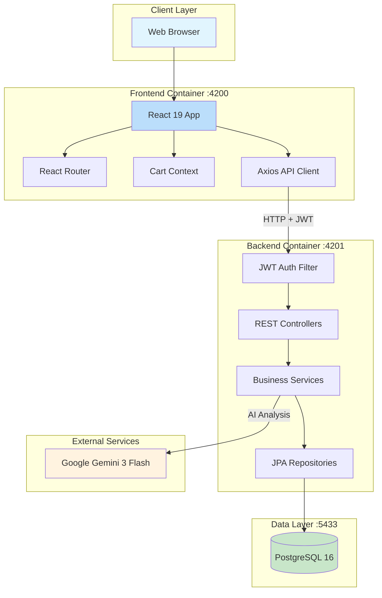

---

## 2. Entity Relationship Diagram

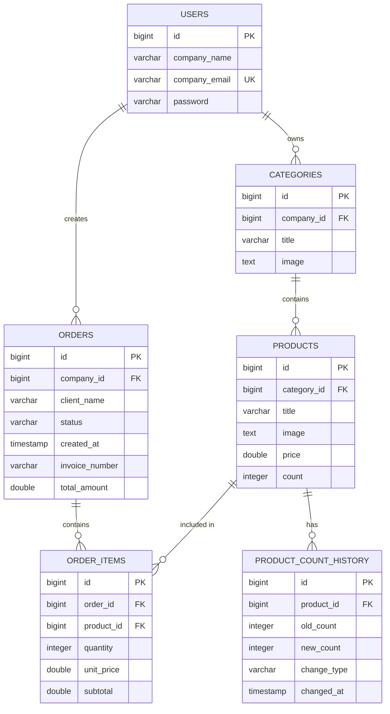

---

## 3. Authentication Flow

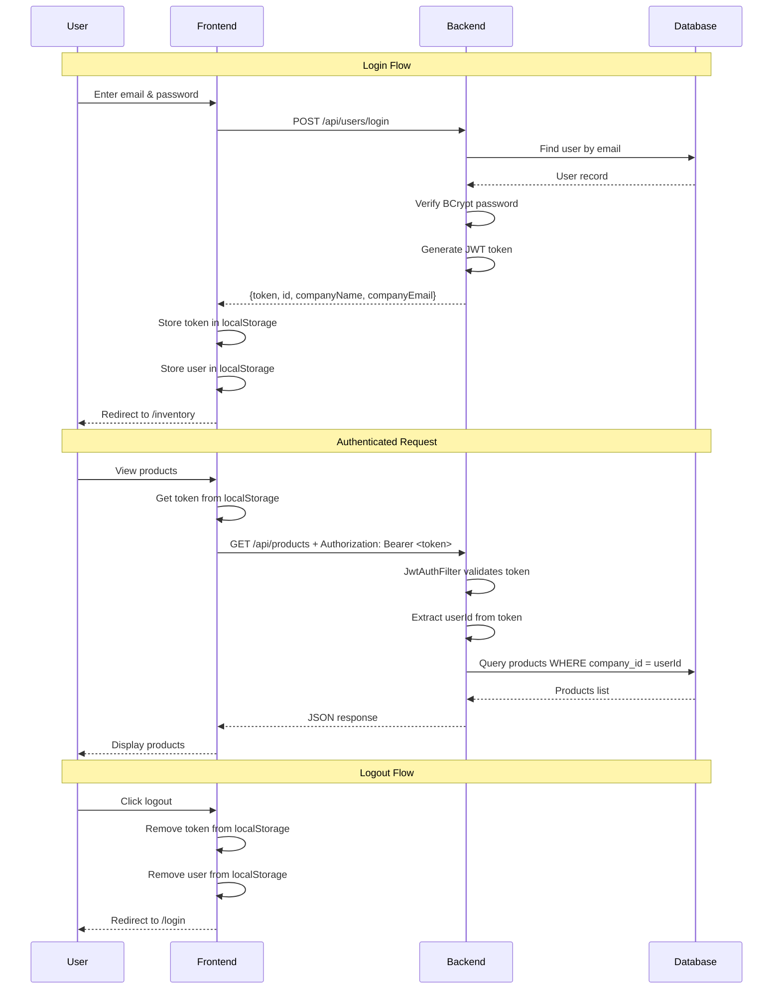

---

## 4. Order Workflow

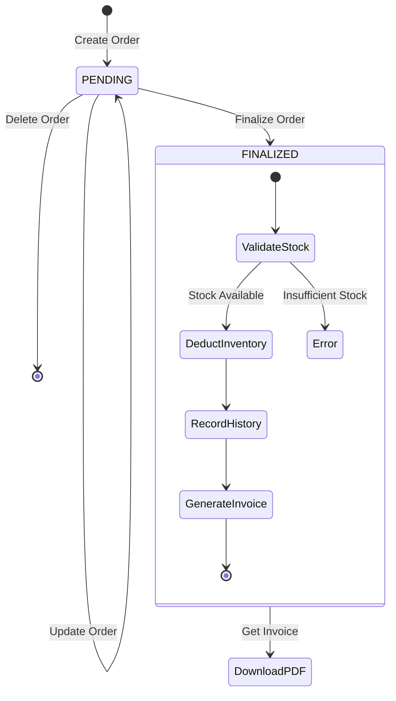

---

## 5. Order Finalization Process

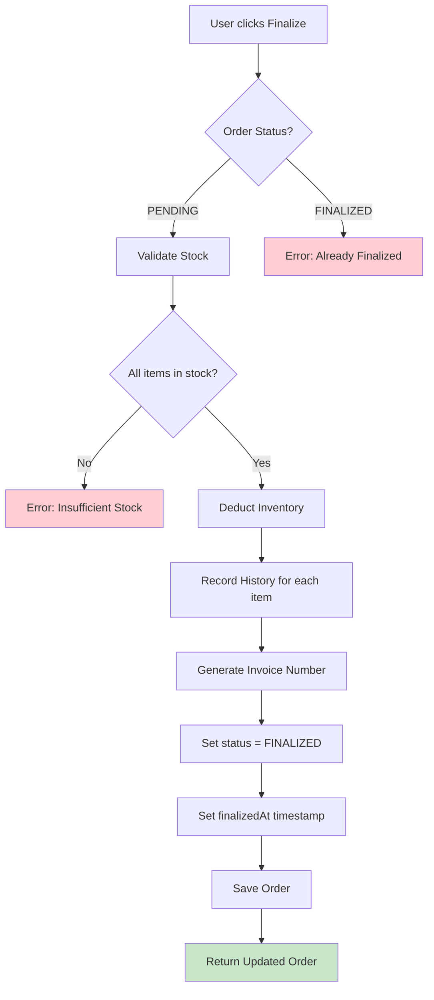

---

## 6. AI Analysis Flow

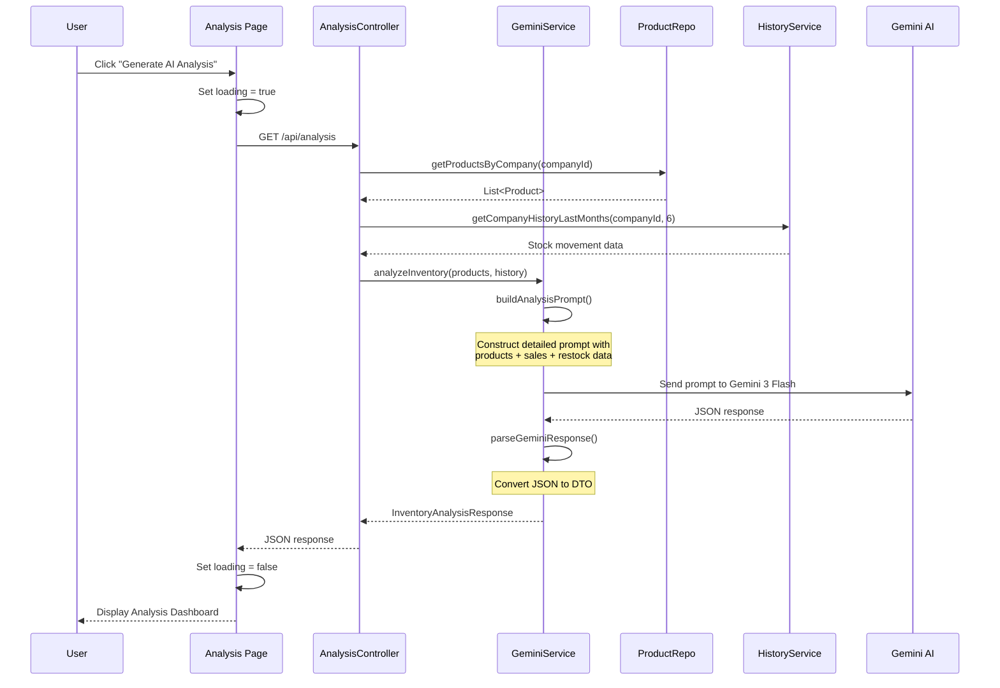

---

## 7. Frontend Component Hierarchy

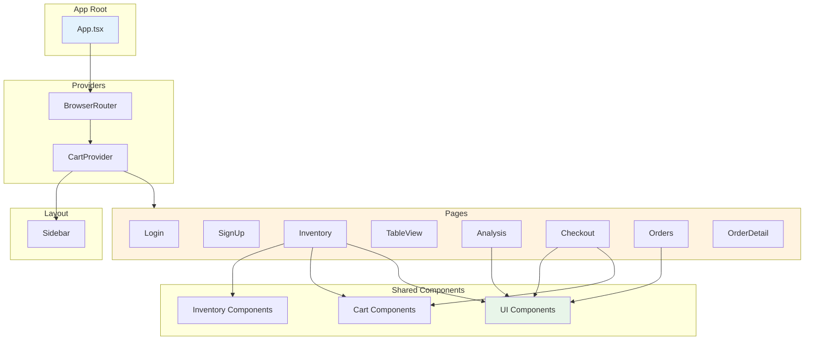

---

## 8. Backend Layer Architecture

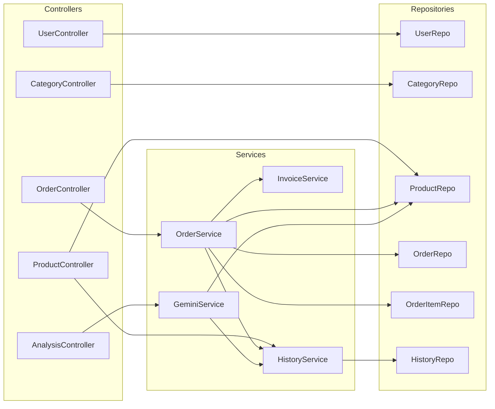

---

## 9. Multi-Tenant Data Isolation

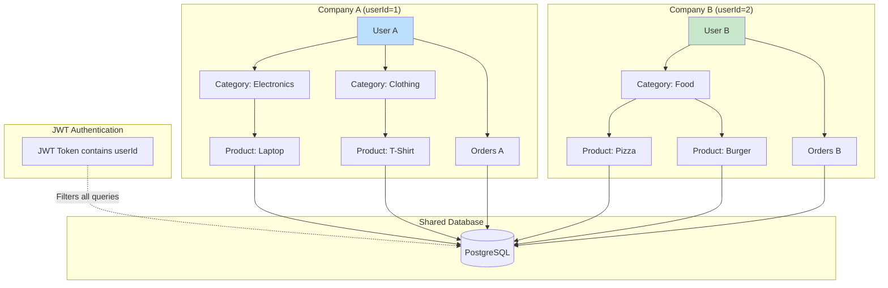

---

## 10. Docker Container Architecture

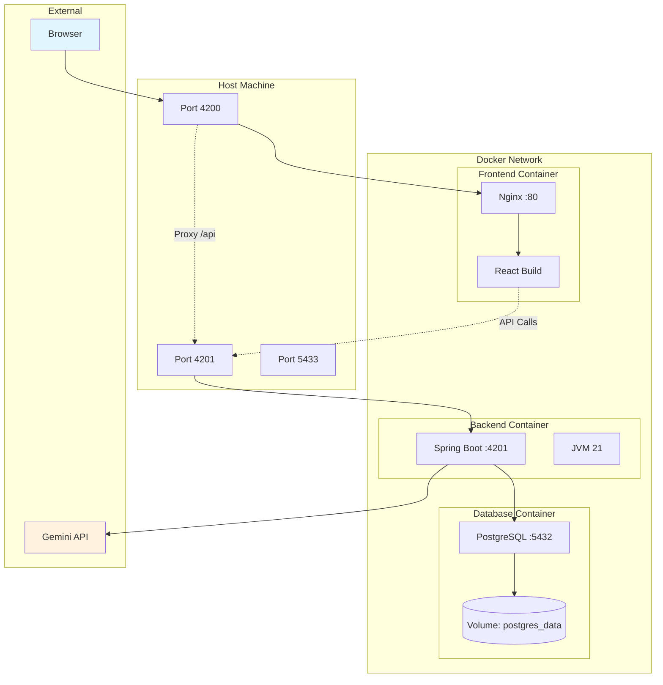

---

## 11. Request Lifecycle

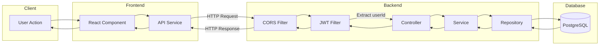

---

## Usage Instructions

### Rendering in GitHub
Simply view any `.md` file containing these diagrams in GitHub - they render automatically.

### Rendering Locally
1. Install VS Code extension: "Markdown Preview Mermaid Support"
2. Open any diagram file
3. Press `Ctrl+Shift+V` to preview

### Export to Image
1. Go to [Mermaid Live Editor](https://mermaid.live/)
2. Paste any diagram code
3. Download as PNG, SVG, or PDF

### Embedding in Documents
Use the exported images in:
- PowerPoint/Google Slides
- Word/Google Docs
- Confluence/Notion
- Any documentation platform
